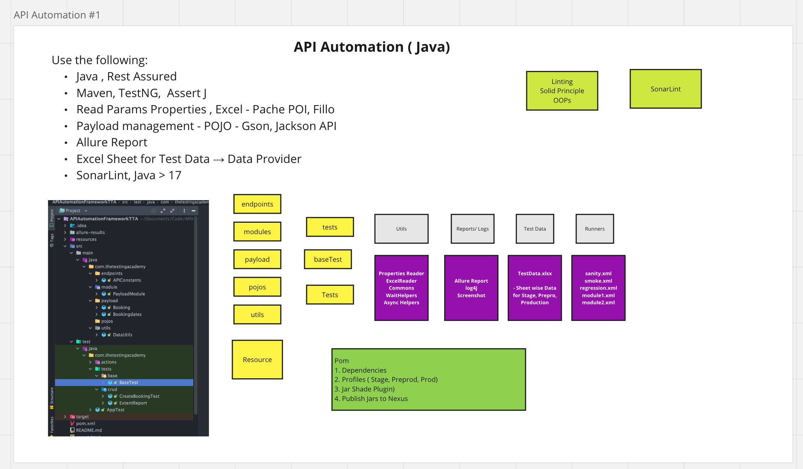
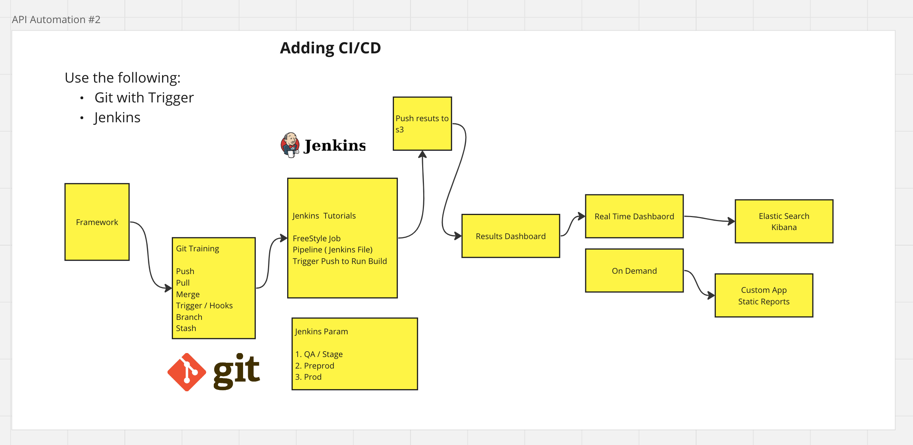

API Automation Framework with the CRUD of Restful Booker

mvn test -Dsurefire.suiteXmlFiles=testng.xml

Tech Stack

Rest Assured

Java

Apache POI, TestNG, Maven

Jackson and GSON

Log42

Allure Report

Full Folder Structure(Hybrid) Framework.
Jenkins File

Basic Create Test

mvn clean test

Integration Test (Create BookinG and Create Token , Update and Delete Booking)
mvn clean test -DsuiteXmlFile=testng-integration.xml

Try these Cases also
POSTMAN Assignments 
Assignment 1

Create the Collections for the This Test cases :

App - Restful Booker with(Auth)

Create a Booking, Update the Booking Name, Get the Booking by Id and verify.
Create a Booking, Delete the Booking with Id and Verify using GET request that it should not exist.
Get an Existing Booking from Get All Bookings Ids , Update a Booking and Verify using GET by id.
Create a BOOKING, Delete It
Invalid Creation - enter a wrong payload or Wrong JSON.
Trying to Update on a Delete Id
Test for the Single Req

Response
Status Code
Headers
———

Create Collection

RestfulBooker CRUD operation.
Add from Snippets , Test cases
Integration Scenarios (Hard Coded)
Assert. - Should not happen (9%) Expect. - Actual Result == Expected ( 90%) Should - Hard it should happen (1%)

Assignments 2

Full CRUD Test cases for the Github Repo API with Integration Scenarios

Create a Test Cases on Template.
Submit the Postman Collection with Test cases Added
Add the Test cases and integration scenarios also
Write Better Advance Postman Test cases.
Assignments 3

Get Token ( 2 Step)
Upload image on Imgur with OAuth 2.0 ( hash will be generated)
Get that image and verify the link hash
Assignments 4

Try the Complex JSON Parsing with the Map and Filters On Assignment Tab.

Assignments 5

Add JSON Schema Validation for POST, PUT Request for the Restful BOOker.